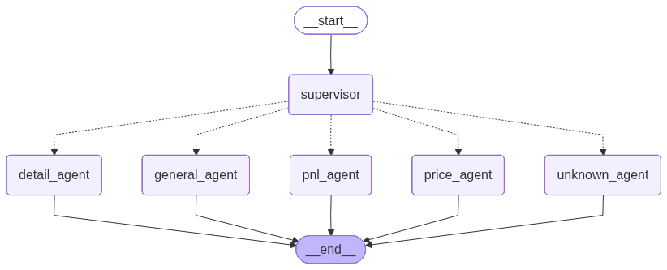

# Real Estate Asset Management — Multi-Agent System

This project implements a prototype multi-agent system for managing real estate assets using LangGraph (LangChain). It can handle queries such as property price comparisons, total P&L calculation, and retrieving property details, all from natural language input.

---

## Setup Instructions

### 1. **Prerequisites**

- Python 3.11+
- An [OpenAI API Key](https://platform.openai.com/settings/organization/api-keys)
- An [Gemini API Key](https://aistudio.google.com/api-keys)
- An [Anthropic API key](https://platform.claude.com/settings/keys)

### 2. **Clone the Repository**

```bash
git clone https://github.com/nelsondressler/real-estate-agent.git
cd real-estate-agent/src
```

### 3. **Create a Virtual Environment**

```bash
python -m venv .venv
source .venv/bin/activate        # Linux / macOS
venv\\Scripts\\activate           # Windows CMD
.venv\Scripts\activate           # Windows PowerShell
```

### 4. **Install Dependencies**

```bash
pip install -r requirements.txt
```

The main dependencies include pydantic, pandas, langchain, langgraph, openai, gemini, anthropic, and streamlit (for the UI).

### 5. **Configure Environment Variables**

```bash
cp .env.example .env
# Open .env and add your ANTHROPIC_API_KEY
```

`.env` contents:
```
DATA_PATH=../data/cortex.parquet
LANGSMITH_TRACING=true
LANGSMITH_API_KEY=...
OPENAI_API_KEY=...
GEMINI_API_KEY=...
ANTHROPIC_API_KEY=...
```

### 6. **Data Preparation:**

Ensure the file cortex.parquet (property catalog) is in the data/ directory.

Copy `cortex.parquet` into the `data/` folder:

```bash
cp /path/to/cortex.parquet data/cortex.parquet
```

### 7. **Run the Application**

**CLI mode:**
Run the CLI mode to interact with the agent by terminal:
```bash
python main.py
```

**Streamlit UI:**

Start the Streamlit app to interact with the agent through the UI:
```bash
streamlit run ui/app.py
```

---

## Demo

```
You: What is the price of my asset at 123 Main St compared to 456 Oak Ave?
Assistant: The asset at 123 Main St is valued at $520,000, while the one at 456 Oak Ave is valued at $475,000 — a difference of $45,000 (≈9%).

You: What is the total P&L for all my properties this year?
Assistant: The total Profit & Loss across your entire portfolio is $1,340,000.
```

---

## Architecture



<!-- ```
User Input
    │
    ▼
┌─────────────────────────────┐
│        Supervisor Agent     │  ← Detects intent, extracts addresses
└──────────────┬──────────────┘
               │  conditional routing
   ┌───────────┼───────────┬──────────┐
   ▼           ▼           ▼          ▼
Price        P&L        Detail    General /
Agent        Agent      Agent     Unknown Agent
   │           │           │          │
   └───────────┴───────────┴──────────┘
                       │
                   Final Response
``` -->

### Agent Responsibilities

| Agent | Intent | Description |
|---|---|---|
| **Supervisor** | — | Routes the query to the correct specialist |
| **Price Agent** | `price` | Compares property current values |
| **P&L Agent** | `pnl` | Calculates profit & loss (portfolio or individual) |
| **Detail Agent** | `detail` | Returns full property details |
| **General Agent** | `general` | Answers generic real estate knowledge questions |
| **Unknown Agent** | `unknown` | Handles ambiguous or unsupported requests gracefully |

---

## Project Structure

```
real_estate_agent/
    ├── data/
    ├── docs/
    ├── notebooks/
    └── src/
        ├── agents/
        │   ├── __init__.py
        │   ├── detail_agent.py
        │   ├── general_agent.py
        │   ├── pnl_agent.py
        │   ├── price_agent.py
        │   └── supervisor.py
        ├── app.py
        ├── main.py
        ├── state/
        │   ├── __init__.py
        │   └── agent_state.py
        ├── tools/
        │   ├── __init__.py
        │   └── data_tools.py
        ├── utils/
        │   ├── __init__.py
        │   ├── data_loader.py
        │   └── llm_client.py
        └── workflows/
            ├── __init__.py
            └── graph.py
```

---

## Implementation Choices

### LLM — Openai

### LLM — Gemini 2.5 Flash

### LLM — Claude 3.5 Haiku
Chosen for its low latency and cost efficiency while maintaining high accuracy for structured tasks like intent classification and address extraction.

### Orchestration — LangGraph
LangGraph's `StateGraph` provides explicit, traceable control flow between agents. Conditional edges make the routing logic transparent and easy to extend.

### Data layer — Pandas + Parquet
The `cortex.parquet` file is loaded once into a shared DataFrame. All agents query it through pure functions in `tools/data_tools.py`, keeping data access decoupled from agent logic.

### Temperature = 0
Set to zero on all LLM calls to ensure deterministic, reproducible results — critical for financial data tasks.

---

## Multi-Agent Workflow (LangGraph)

```
START
  └── supervisor_node
        ├── (intent=price)   → price_agent_node   → END
        ├── (intent=pnl)     → pnl_agent_node     → END
        ├── (intent=detail)  → detail_agent_node  → END
        ├── (intent=general) → general_agent_node → END
        └── (intent=unknown) → unknown_agent_node → END
```

The supervisor always runs first. Its output (`intent` + `extracted_addresses`) is stored in the shared `AgentState` and consumed by whichever specialist node runs next.

---

## Error Handling & Edge Cases

| Scenario | Behaviour |
|---|---|
| Address not in dataset | Returns a friendly "not found" message |
| Partial address match | Uses case-insensitive substring search |
| No address provided for portfolio P&L | Aggregates across all properties |
| Ambiguous or unsupported request | Routed to `unknown_agent` with a help message |
| LLM returns invalid JSON | Supervisor falls back to `intent=unknown` |

---

## Challenges & Solutions

| Challenge | Solution |
|---|---|
| Reliable intent classification | Strict JSON-only prompt with enumerated intent values |
| Address extraction from free text | Delegated entirely to the LLM via structured output |
| Keeping agents independent | Shared `AgentState` TypedDict; agents only read/write their own fields |
| P&L with missing financial columns | `row.get("annual_income", 0)` with safe defaults |
